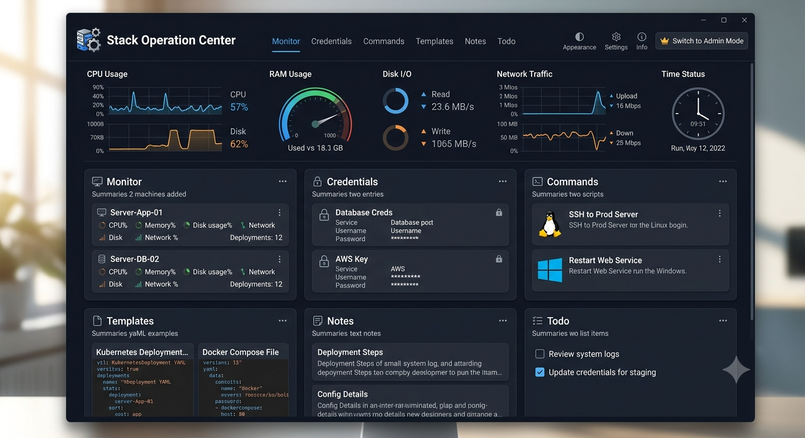
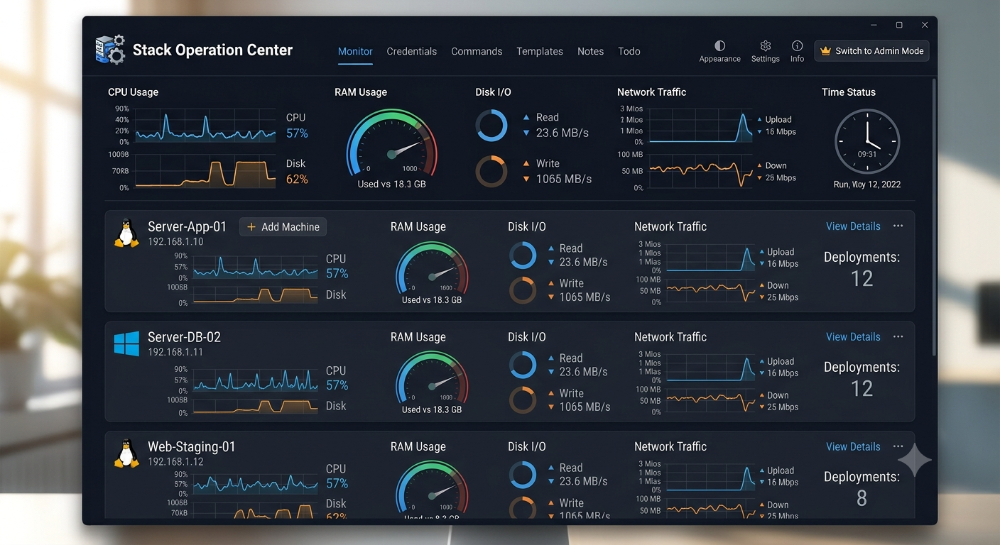
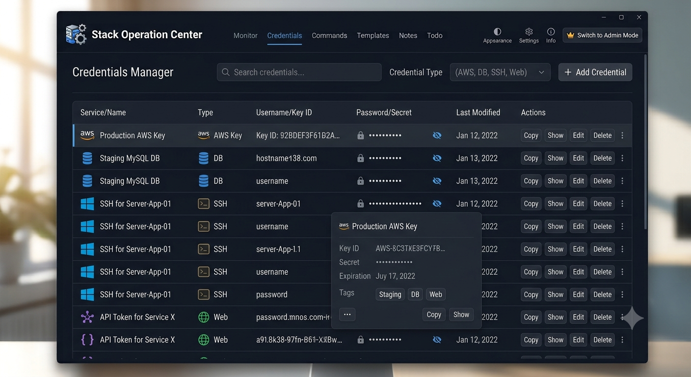
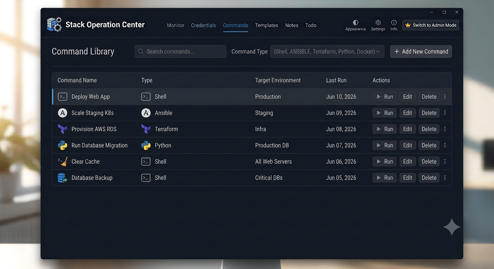
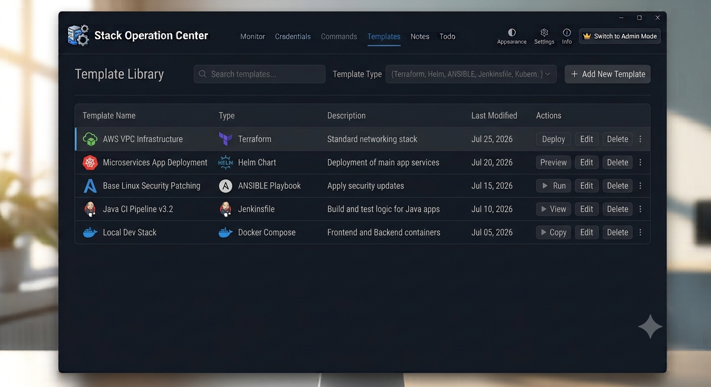
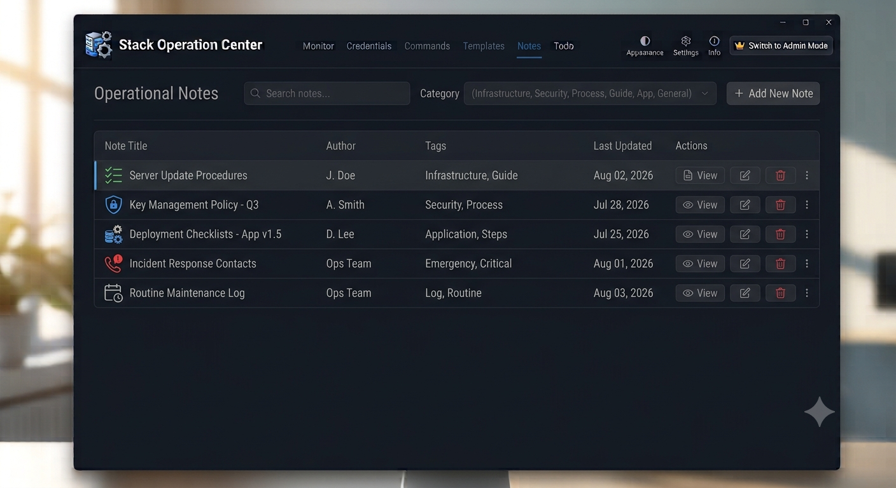
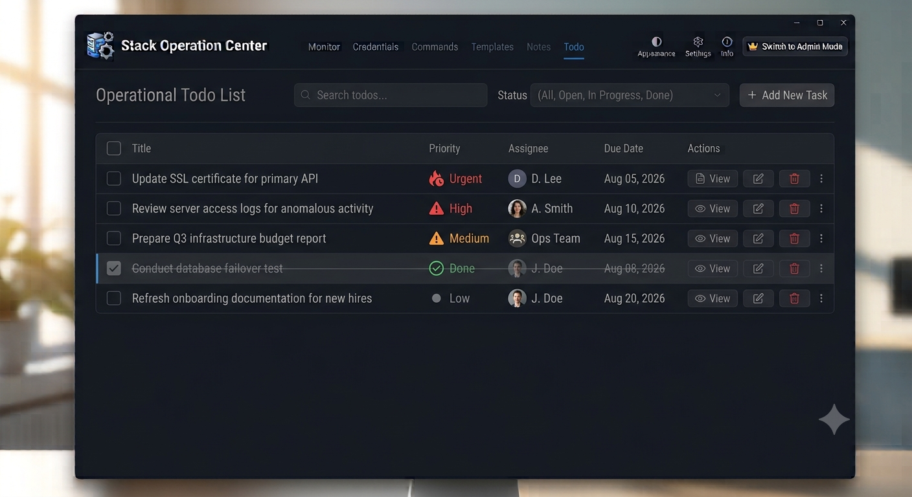

# Stack Operation Center (BETA)

Stack Operation Center is a beta desktop application designed for developers, operators, and technical teams who want a single workspace to organize infrastructure context, runbook notes, reusable commands, and task tracking.

The app combines a polished desktop experience with practical operational tools so teams can move from observation to action without switching between multiple apps.

## Why this project exists

Modern development and DevOps work often involves juggling many moving parts:

- machine inventory and monitoring
- credentials and access information
- reusable commands and scripts
- templates and notes
- task tracking and follow-up work

Stack Operation Center brings these elements together in one place, with a clean interface and local data storage for fast, focused work.

## Key features

- Dashboard with live system metrics for CPU, memory, disk, and network activity
- Machine monitoring and inventory management
- Secure credential tracking for services and systems
- Reusable command library for common operations
- Template storage for YAML, scripts, and other reusable snippets
- Notes and todo management for day-to-day operational work
- Light and dark appearance support for different working environments
- Local SQLite-backed persistence for simple deployment and use

## Screenshots

The screenshots below are stored in the images folder and reflect the current beta experience of the application. (Images created by AI for show final looks of app)















## Tech stack

- Python
- PySide6 for the desktop interface
- SQLAlchemy for database access
- psutil for system metrics
- paramiko for remote operations support

## Getting started

### Prerequisites

- Python 3.9 or newer
- pip

### Installation

```bash
cd /path/to/stack-operation-center-desktop-app
python3 -m venv .venv
source .venv/bin/activate
pip install -r requirements.txt
```

### Run the app

```bash
python3 main.py
```

## Project structure

- main.py: application entry point and main window setup
- views.py: UI views for dashboard, monitor, credentials, commands, templates, notes, and todo
- database.py: database models and session handling
- dialogs.py: add/edit dialog components
- components.py: reusable UI components
- migrate_db.py: database migration helpers
- images/: screenshots and UI assets

## Data and storage

The app uses a local SQLite database file named stack_ops.db. This keeps the experience simple for beta testing and local use while still providing structured, persistent records.

## Development notes

This is a beta release, so features and workflows may evolve over time. Feedback, UI ideas, and operational use cases are welcome as the project grows.

## Contributing

Contributions are welcome. If you would like to improve the app, add features, or refine the experience, please open an issue or submit a pull request.

## License

This project is currently distributed as a beta development project. Please review the repository contents and use it in accordance with your organization’s internal policies before deployment.


##get apckage
for mac
python3 -m pip install pyinstaller
python -m PyInstaller --onefile --windowed main.py

for windows


for linux

